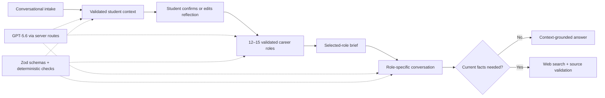

# Steppi

> See more possible futures before choosing what comes next.

**OpenAI Build Week · Education track**

Steppi is a career-exploration experience for high-school and college students.
It turns the interests, studies, projects, responsibilities, and uncertainties a
student shares into a broad set of career roles they can understand and explore.

It does not score aptitude, rank a “best” career, or pretend to predict a
student’s future. Steppi helps students build career literacy: see more
possibilities, understand the work, and choose a small next step worth trying.

## The problem

Students often know what they enjoy without knowing how those experiences map to
real work. Traditional career tools can make that harder by starting with
abstract personality tests, returning a handful of familiar categories, or
producing long reports that feel more like verdicts than invitations to explore.

Steppi takes a **breadth-before-depth** approach. It first opens the student’s
view of what is possible, then lets their curiosity decide where to go deeper.

## How it works

1. **Talk naturally.** A short conversational intake asks about interests,
   classes, projects, work, responsibilities, dislikes, strengths, and practical
   considerations.
2. **Confirm the reflection.** GPT-5.6 turns that conversation into a validated
   structured context and a two-sentence reflection. The student can accept,
   inspect, or rewrite it before anything is suggested.
3. **Discover possibilities.** Steppi generates 12–15 meaningfully varied,
   unranked career roles, targeting thirteen in the normal flow.
4. **Understand one role quickly.** Every role explains what it is, why it may
   fit, why it may not fit, what the day-to-day feels like, and one low-risk way
   to try it.
5. **Ask what actually matters.** The student can continue with a natural
   follow-up. Each role keeps its own conversation during the active visit.
6. **Research only when needed.** Questions about current programs, costs,
   admissions, licensing, salary, or local opportunities trigger source-aware
   research. Unsupported current claims are not shown.

The intended result is not a career decision. It is a better question, a more
interesting possibility, and one concrete next step.

## Why GPT-5.6 is essential

GPT-5.6 is not a decorative chat layer in Steppi. It performs the parts of the
experience that require judgment across messy, incomplete student context:

- synthesizing a conversation while keeping student statements, model
  inferences, constraints, tensions, and uncertainty distinct;
- generating a varied set of roles instead of near-duplicate job titles;
- connecting possible fit and possible mismatch to evidence from the student;
- maintaining a concise, role-specific conversation; and
- deciding how to synthesize current web evidence when a question depends on
  facts that can change.

Every model boundary uses the OpenAI Responses API with explicit Zod-backed
structured outputs before data reaches the interface. Path generation has a
bounded three-attempt application-level validation policy; incomplete role sets
never reach the student. Role follow-ups are stateless (`store: false`), and the
application forces web search for deterministically recognized unstable topics.

## Product principles

- **Possibilities, not predictions.** Roles are unranked and framed as options
  worth exploring, never as a diagnosis or guaranteed fit.
- **Student control.** The student sees and can edit Steppi’s reflection before
  role generation.
- **Honest tradeoffs.** Every role includes reasons it may fit and reasons it may
  not, without turning either into a verdict.
- **Progressive depth.** The initial role brief stays readable in under a minute;
  deeper detail appears through conversation.
- **Evidence when it matters.** Current external claims require retrieved HTTPS
  sources. Provenance is available without overwhelming the main answer.
- **Safe failure.** Missing, malformed, or unsupported model output produces a
  calm retry or unavailable state rather than fabricated content.

## Architecture



All OpenAI calls run in Next.js server routes. API keys, raw provider errors,
and environment values are never sent to the browser. Active product state is
in memory and clears on refresh; authentication and long-term persistence are
intentionally outside the Build Week scope.

## Tech stack

- Next.js 16 App Router and React 19
- TypeScript in strict mode
- Tailwind CSS 4
- OpenAI JavaScript SDK and Responses API
- Zod structured-output and runtime validation
- Vitest
- Vercel deployment target

## Run locally

Requirements: Node.js 20.9 or newer and npm.

```bash
npm install
cp .env.example .env.local
```

Add server-only OpenAI credentials to `.env.local`:

```text
OPENAI_API_KEY=your_openai_api_key
OPENAI_MODEL=gpt-5.6-luna
```

Then start the app:

```bash
npm run dev
```

Open [http://localhost:3000](http://localhost:3000). Never expose the API key
through a `NEXT_PUBLIC_` variable or commit `.env.local`.

## Demo walkthrough

From the landing page, select **Start exploring**, then:

1. complete the short intake;
2. confirm or edit Steppi’s two-sentence reflection;
3. select **Explore career roles**;
4. choose any role in the possibility space;
5. read its fit, tension, day-to-day, and low-risk experiment; and
6. ask one interpretive question and one question that needs current sources.

Examples: “How creative is this work?” and “Are there affordable programs near
me?” The second question demonstrates conditional research and progressively
disclosed source details.

Development fixtures can verify conversation states without paid model calls:

```text
/intake?fixture=conversation-success
/intake?fixture=conversation-researched
/intake?fixture=conversation-unavailable
/intake?fixture=conversation-api-failure
/intake?fixture=conversation-malformed
```

## Quality and verification

```bash
npm run lint
npm run typecheck
npm run test
npm run build
```

The latest completed product verification passed lint, strict type checking, 206
tests across 27 files, a production build, desktop and mobile browser checks,
keyboard interaction, reduced motion, and malformed-output and failure-state
fixtures. See [the build log](docs/BUILD_LOG.md) for detailed evidence and
[the active handoff](docs/TASKS.md) for current limitations.

## Deployment status

The existing [Vercel preview](https://steppi-openai-build-week-2ibzu4h54-pgc9002-3129s-projects.vercel.app)
is anonymously reachable, but it serves an older Grade 11 / three-path build.
It is **not the submission demo** until the current 12–15-role product has been
redeployed and its anonymous golden path has been verified.

For Vercel, configure `OPENAI_API_KEY` and `OPENAI_MODEL=gpt-5.6-luna` as server-side
environment variables for the target environment, then redeploy. Existing
deployments do not inherit environment-variable changes automatically.

## Current limitations

- Refreshing clears the intake, role set, and role conversations.
- There are no accounts, persistent profiles, admissions predictions, job
  placement features, or comprehensive career and college databases.
- Current-source conversation behavior has deterministic mocked coverage but has
  not received a fresh live GPT-5.6 quality pass after the latest changes.

## Project docs

- [Product vision](docs/VISION.md)
- [Build Week specification](docs/SPEC.md)
- [Operational handoff](docs/TASKS.md)
- [Implementation and verification log](docs/BUILD_LOG.md)

Built by [Pope Cruz](https://github.com/pope-cruz) for OpenAI Build Week.
